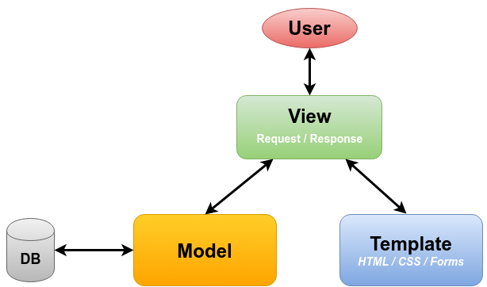

# Technical documentation for We Predicted That pokemon battle predictor

## Step 4 - Building a web app in Django

One of the goals we decided at the start of this project was to learn a new language - Python seemed the obvious choice since the project revolved around machine learning, and it's the language of choice for many ML libraries (for example, it's the only fully supported language for TensorFlow).  When it came to creating a web app to interact with our model, we were keen to continue building our knowledge of Python rather than sticking with a known framework such as Rails, so we picked Django to build the app.


Django follows Model-View-Template (MVT) pattern compared to the Model-View-Controller (MVC) pattern.

The following diagram illustrates how each of the components of the MVT pattern interacts with each other to serve a user request −



1. Start new project pokemonweb by entering below command from command line:

```
django-admin startproject pokemonweb
```
This will create a pokemonnweb directory with following in your current directory.
- manage.py: A command-line utility that lets you interact with this Django project in various      ways.
- __init__.py: An empty file that tells Python that this directory should be                        considered a Python package.
- settings.py: Settings/configuration for this Django project. Django settings will tell     you    all about how settings work.
- urls.py: The URL declarations for this Django project; a “table of contents” of your              Django-powered site.
- wsgi.py: An entry-point for WSGI-compatible web servers to serve your project. 

2. Create app battle :

```
python manage.py startapp battle
```
3. Run server :

```
python manage.py runserver
```
4. We decided to use PostgreSQL instead of Django default SQLite database because its a              production grade database.

5. To run tests we need to change following in settings.py:
- This setting is required so that our tests can run; even though this is not
  required when running the server locally.

```
DEBUG = True

ALLOWED_HOSTS = ['127.0.0.1', 'localhost', '']
```
-To run feature test we need to run below command so that static files are available for the test to run:

```
python manage.py collectstatic
```

### Python

Python is a multi-paradigm language that supports both object-oriented and functional programming approaches.  We used Python 3.6, the latest release, and found that the Python syntax was reasonably familiar given our prior background in Ruby.  Perhaps the greatest challenge we had with Python was getting used to its rigorous approach to indentation but the upside of this was the improvement of our general coding discipline.

### Django, MTVs and MVCs

The Django web-framework provided us with the structure for our application.  The principal challenge for us in this area involved the basic difference between Rails and Django - the MTV v MVC structure.

Rails employs a Model-View-Controller framework whereby:
 - the classes of object that interface with the application's back-end database are contained within the Model(s) part of the framework - i.e. this is where the data is dealt with;
 - the final presentation layer to the end user is dealt with in Views; and
 - the central business logic of the application is dealt with in Controllers.

 Django employs a similar Model-Template-View but with differences whereby:
 - the classes of object that interface with the back-end are also contained within Models;
 - the final presentation layer to the end user is dealt with in Templates; and
 - the central business logic of the application is dealt with in Views.

 These contrasting approaches involve differences with the way that the framework is organised - for instance, Django's structure arguably places the logic of the application more centrally in the framework, rather than moving this away into its own folder structure.  This caused some confusion when coming to Django from a Rails background but once we had got on top of this, we were able get up to speed quite quickly.

 ### Testing

Python's testing frameworks presented further challenges for us.  The basic testing suite is provided by the in-built unittest library.  This differed in several important respects from the testing frameworks that we have become familiar with, such as Rspec for Ruby and Jasmine for JavaScript.

Particular areas of note were:
- each test forms a method within a test class (or fixture), taking the main object as an argument.
- the assertions available to us through unittest were more limited than those that we had become used to through Rspec and Jasmine.
- feature testing in general appears to be less supported in Python, or through unittest at least.

